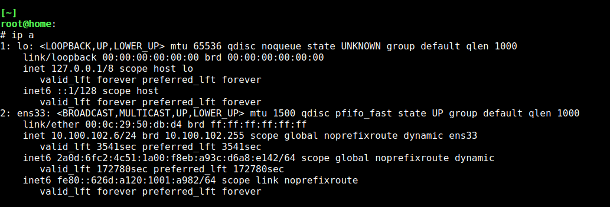
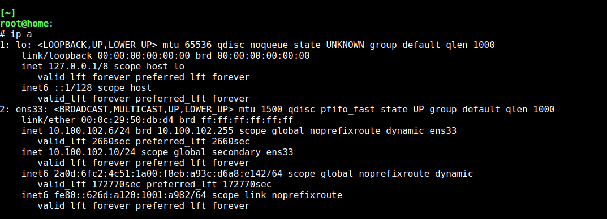

# Домашнее задание №6

Цель: в результате выполнения ДЗ вы получите базовые навыки настройки сети в Linux.

В данном задании тренируются навыки:

- работа с файлами конфигурации ОС Linux;
- проверка работоспособности конфигурации;
- работа с базовыми командами для настройки сети в Linux.

Необходимо:

- назначить IP адрес для интерфейса с помощью команды ip;
- назначить адрес dns сервера;
- добавить маршрут по умолчанию;
- написать файл конфигурации сети с настроенными ранее параметрами.

# Ход работы

Работа выполнялась на CentOS 7.

## Назначение IP-адреса

Для задания IP-адреса интерфейса возпользуемся командой `ip`:

```bash
# узнаем имена интерфейсов и текущий назначенный адрес
ip a
```


```bash
# добавим интерфейсу ens33 адрес 10.100.102.10/24
ip addr add 10.100.102.10/24  dev ens33
# проверим результат
ip a
```


Если у интерфейса уже был адрес, то его можно удалить командой `ip addr del $ADDR dev ens33`.

При удаленном подключении важно сначала добавить новый адрес, переподключиться по нему и только после этого удалять прошлый адрес, в противном случае возможна потеря удаленного доступа.

Установленный таким образом адрес будет сброшен при перезагрузке компьютера или перезапуске сети. См. раздел "Файл конфигурации сети".

## Назначение адреса DNS-сервера

Текущие адреса используемых DNS-серверов хранятся в файле `/etc/resolv.conf` в строках, начинающихся с nameserver, соответственно, для изменения DNS-сервера необходимо отредактировать данный файл.

```bash
# смотрим текущие адреса DNS-серверов
cat /etc/resolv.conf
# заменяем DNS на Google DNS и роутер
echo "nameserver 8.8.8.8" | tee /etc/resolv.conf
echo "nameserver 10.100.102.1" | tee -a /etc/resolv.conf
```

Изменения применяются при следующем же запросе определения адреса по доменному имени. Проверить можно, например, с помощью утилиты `nslookup` из пакета `bind-utils`:

```bash
yum install -y bind-utils
nslookup ya.ru
```

Выводе будет отражен используемый DNS-сервер:

```
Server:         8.8.8.8
Address:        8.8.8.8#53

Non-authoritative answer:
Name:   ya.ru
Address: 87.250.250.242
Name:   ya.ru
Address: 2a02:6b8::2:242
```

Установленные таким образом адреса будет сброшены при перезагрузке компьютера или перезапуске сети. См. раздел "Файл конфигурации сети".

## Добавление маршрутов

Работа с текущей таблицей маршрутов осуществляется командой `ip` с параметром `route`. Установим в качестве маршрута по-умолчанию маршрут через роутер с адресом `10.100.102.1`:

```bash
ip route add default via 10.100.102.1
# проверим сформированную таблицу маршрутизации
ip route
```

В выводе команды будет строка вида:

```
default via 10.100.102.1 dev ens33
```

Таким образом, все пакеты с адресами, не принадлежащими локальной сети 10.100.102.0/24 будут адресованы на шлюз с адресом 10.100.102.1.

Установленные таким образом маршруты будут сброшены при перезагрузке компьютера или перезапуске сети. См. раздел "Файл конфигурации сети".

## Файл конфигурации сети

Для того, чтобы конфигурация сети сохранялась после перезапуска сети или перезагрузки конмпьютера необходимо внести изменения в конфигурационные файлы. В контексте данной работы интересны 2 файла: `/etc/sysconfig/network-scripts/ifcfg-ens33` и `/etc/sysconfig/network-scripts/route-ens33`, где `ens33` - имя конфигурируемого интерфейса.

Файл `/etc/sysconfig/network-scripts/ifcfg-ens33` содержит параметры конкретного сетевого интерфейса:

```
DEVICE="ens33"
BOOTPROTO="static"
ONBOOT="yes"
TYPE="Ethernet"
IPV6INIT=no
IPADDR=10.100.102.10
NETMASK=255.255.255.0
GATEWAY=10.100.102.1
DNS1=8.8.8.8
DNS2=10.100.102.1
```

В данном случае для интерфейса `ens33` отключаем автоматическое получение адресов через DHCP, отключаем IPv6, задаем адрес IPv4 `10.100.102.10`, 
сетевую маску `/24`, шлюз по умолчанию `10.100.102.1`  и DNS-сервера `8.8.8.8` и `10.100.102.1`.

Файл `/etc/sysconfig/network-scripts/route-ens33` содержит информацию о статических маршрутах для данного интерфейса:

```
default via 10.100.102.1 dev ens33
```

Перезапускаем сеть и проверяем примененные параметры:

```bash
systemctl restart network
ip a
ip r
```

Таким образом, редактируя скрипты в каталоге `/etc/sysconfig/network-scripts/`, можно задать конфигурацию сети, которая сохраняется после перезапуска сети или перезагрузки компьютера.
